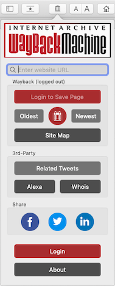

## Wayback Machine Safari Extension ##

By [Internet Archive](https://archive.org)

The Internet Archive presents 
The Official WayBack Machine Extension. With the power of the WayBack Machine, we let you go back in time to see how a website has changed and evolved through the history of the Web!

### Dependencies ###

- macOS 10.14 Mojave or later
- Xcode 10.3+
- [Cocoa Pods](https://guides.cocoapods.org/using/getting-started.html): `sudo gem install cocoapods`
- Run in directory that contains Podfile: `pod install --verbose`

### How To Update Build & Version Numbers ###

From the left panel, do a global search for the following strings, select and search again in the main window to find the numbers to replace. There should be 2 numbers to modify for each.

- `CURRENT_PROJECT_VERSION` - for Build, to increment on every Test Build.
- `MARKETING_VERSION` - for Version, to increment on App Store release.

### How To Build & Release App Binary ###

1. From menu: **Product > Archive**, then **Distribute App**.
2. Select either **Mac App Store** to submit for review, or **Copy App** to distribute a Test Build.
3. If distributing a Test Build, find where you saved the file, then rename the directory that contains `Wayback Machine.app` (or create a new directory and copy it over.)
4. Copy `INSTALL_README.txt` into the same directory.
5. Compress into a ZIP and distribute.

### How To Install From App Binary ###

1. Open Safari:
  - If **Develop** menu isn't visible: **Preferences > Advanced tab > ☑️ Show Develop menu in menu bar**
  - From menu: **Develop > ☑️ Allow Unsigned Extensions**
  - *Don't Quit Safari yet!*

2. Move or copy **Wayback Machine.app** to final location before running.
  - You may want to Uninstall the old build first before installing the new build. Go to **Safari > Preferences > Extensions tab**, then **Uninstall > Show in Finder** and move the .app to Trash.
  - Recommended to move new build into main Applications folder.
  - Double-click to run the app.

3. Alert may popup saying it can't be opened. (*thanks Catalina!*)
  - If so, go to: **System Preferences > Security & Privacy > Open Anyway** button.

4. Wayback Machine app will now open.
  - Tap **Show Preferences**.
  - ☑️ **Wayback Machine**
  - You may close the app window. The extension should now show up as a button on Safari's toolbar.

#### Notes ####

- The Extension should have full permissions, but sometimes it doesn't. If not, you may need to delete it and start over from the ZIP file.
- Every time you restart Safari, you'll need to ☑️ **Allow Unsigned Extensions**.

### Troubleshooting ###

- We don't automatically manage signing. You may need Signing Certificates to compile.

- To turn on Debug Logs, set `DEBUG_LOG = true` in *WMConstants.swift*.

## License ##

Copyright (c) 2017-2020 Internet Archive. All Rights Reserved.

Licensed under the the terms of the [GNU Affero General Public License version 3 (AGPLv3)](http://www.gnu.org/licenses/agpl-3.0.html)
